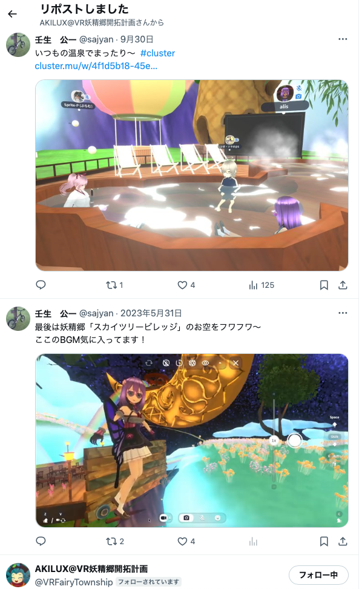

# 20241003_cluster

<html>
<head>

<meta charset="UTF-8">
<meta http-equiv="Content-Type" content="text/html; charset=UTF-8">
<meta http-equiv="X-UA-Compatible" content="IE=EmulateIE10" />
<meta http-equiv="X-UA-Compatible" content="IE=edge">

<!--ここから上はお決まりの定型文です-->

<!--ここからが表現の書式などを決めるcssという部分-->

<link href="https://cdnjs.cloudflare.com/ajax/libs/lightbox2/2.7.1/css/lightbox.css" rel="stylesheet">

</head>

<body>

モバイル端末をお使いの場合は、画面を横向きにすると
より見やすくご覧頂けます。

<!--ここ上は、ほぼそのまま使います！-->

<!--QRコードの挿入例-->

 アクセス用QRコード

<marquee direction="left" scrollamount="20" width="30%">(^_^)/~hada</marquee>

<!--流れ文字の挿入例-->
<h1><marquee behavior="left">!!! 2024/10/3 、メタバース空間「Cluster Accelerator」へ推薦いただきました !!!</marquee></h1>

<!--上段にパンクズリストを入れる時の例-->

<a href="https://torokoid.github.io/Mashiko_himawari_4/" target="_blank">2024年8月10日、益子ひまわり祭</a>><a href="https://torokoid.github.io/20240817_hagurosan/" target="_blank">2024年8月17日、羽黒山</a>><a href="https://torokoid.github.io/20240930_hagurosan/" target="_blank">2024年9月30日、羽黒山</a>><a>10月3日、Cluster Accelerator</a>

                          

<!--ここから下が、本体部分-->
<h2>Cluster Acceleratorに推薦頂きました！</h2>

<h2>下から2人目がXアカウント！</h2>

<h2>メタバース空間で開催されるイベントの状況を撮影してXに投稿しまくってました！</h2>

<!--

-->

<h2>イベントの主催者からお礼のメッセージ！</h2>

   
<h2>普段はこんなところに常駐 メタバース内の温泉に浸かっている常連さん AKILUXさんはこのワールドの作者</h2>

   

 <!--
<h2>残暑厳しい中、水泳メンバーが集まりました みんな元気そうです では、又の再会を楽しみにしています！</h2>-->

         

  

      

<!--本体はここまで-->

<!--画面に空白地帯を作って、背景が見えるようにしています-->
                                              

<!-- フッタ -->
<footer>

Copyright 2024/10/03 S.Hada

</footer>

<!--HPにさまざまなJavaScriptを呼び込むための書式-->

